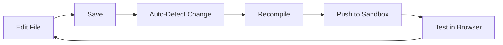

## lua dev

Start development mode with live reloading and chat interface.

```bash
lua dev
```

## What It Does

<Steps>
  <Step title="Compile">
    Compiles your TypeScript code
  </Step>
  
  <Step title="Push to Sandbox">
    Pushes skills to sandbox environment
  </Step>
  
  <Step title="Start Server">
    Launches local web server on port 3000
  </Step>
  
  <Step title="Open Browser">
    Opens chat interface automatically
  </Step>
  
  <Step title="Watch Files">
    Monitors for file changes
  </Step>
  
  <Step title="Auto-Reload">
    Recompiles and pushes on save
  </Step>
</Steps>

## Example Output

```bash
$ lua dev
✅ Authenticated
🔄 Compiling skill...
✅ Skill compiled successfully - 10 tools bundled
🔄 Pushing skills to sandbox...
✅ Pushed 3 skills to sandbox
🌐 Chat interface opened in your browser
🔍 Watching for file changes... (Press Ctrl+C to stop)

# Edit a file and save...
🔄 File changed: src/tools/MyTool.ts - Compiling and pushing...
✅ Compilation completed
✅ Successfully pushed 3 skills to sandbox
```

## Chat Interface

Opens at **http://localhost:3000** with multiple tabs:

<Tabs>
  <Tab title="Chat">
    **Conversational Testing**
    
    - Chat with your AI agent
    - Tests tool selection and execution
    - See real-time responses
    - Test natural language interactions
    
    **Try:**
    - "What's the weather in London?"
    - "Show me your products"
    - "Create a shopping basket"
  </Tab>

  <Tab title="Tools">
    **Individual Tool Testing**
    
    - Select any tool
    - Enter custom inputs
    - See execution results
    - Test edge cases
    
    Same as `lua test` but in browser
  </Tab>

  <Tab title="User Data">
    **View/Modify User Data**
    
    - See current user profile
    - Update user information
    - Test user-specific tools
  </Tab>

  <Tab title="Environment">
    **Manage Environment Variables**
    
    - View all variables
    - Add new variables
    - Edit existing ones
    - Changes saved to `.env`
  </Tab>

  <Tab title="Persona">
    **Configure Agent Personality**
    
    - Customize agent behavior
    - Update brand voice
    - Test different personas
  </Tab>

  <Tab title="Skills">
    **View All Skills & Tools**
    
    - Browse available skills
    - See all tools
    - View tool descriptions
    - Check input schemas
  </Tab>
</Tabs>

## Live Reload Features

### File Watching

<CardGroup cols={2}>
  <Card title="Watches" icon="eye">
    - All `.ts` files in `src/`
    - Tool files
    - Skill definitions
    - Helper services
  </Card>
  <Card title="Ignores" icon="eye-slash">
    - `node_modules/`
    - `dist/`
    - `.lua/`
    - `.git/`
  </Card>
</CardGroup>

### Auto-Reload Workflow



<Steps>
  <Step title="Edit">
    Make changes to any file in `src/`
  </Step>
  
  <Step title="Save">
    Save the file (Cmd+S / Ctrl+S)
  </Step>
  
  <Step title="Auto-Compile">
    CLI detects change and recompiles
  </Step>
  
  <Step title="Auto-Push">
    New version pushed to sandbox
  </Step>
  
  <Step title="Test">
    Immediately test in browser
  </Step>
</Steps>

### Debouncing

Changes are debounced with 500ms delay to prevent multiple compilations when saving multiple files.

## Development Workflow

### Recommended Flow

<Tabs>
  <Tab title="1. Start Dev Mode">
    ```bash
    lua dev
    ```
    
    Keep this running in one terminal
  </Tab>

  <Tab title="2. Edit Files">
    Open your editor and make changes:
    ```typescript
    // src/tools/MyTool.ts
    export default class MyTool implements LuaTool {
      name = "my_tool";
      description = "Updated description";
      
      async execute(input: any) {
        // Your changes here
        return { newFeature: "works!" };
      }
    }
    ```
  </Tab>

  <Tab title="3. Save & Test">
    - Save file (auto-reloads)
    - Test in browser immediately
    - See results in real-time
    - Iterate quickly
  </Tab>

  <Tab title="4. Push When Ready">
    When satisfied:
    ```bash
    # Stop dev mode (Ctrl+C)
    lua push
    lua deploy
    ```
  </Tab>
</Tabs>

## WebSocket Logging

Real-time log streaming from tool execution:

```javascript
// Logs appear in browser console
console.log('Debug info');  // Shows in real-time
console.error('Error!');    // Shows errors
console.warn('Warning');    // Shows warnings
```

## Testing Strategies

### Quick Iteration

```bash
# Terminal 1: Keep dev mode running
lua dev

# Terminal 2: Make changes
vim src/tools/MyTool.ts
# Save and immediately test in browser
```

### Test Different Scenarios

<AccordionGroup>
  <Accordion title="Happy Path">
    Test ideal user journeys:
    - "Show me products"
    - "Add laptop to cart"
    - "Checkout"
  </Accordion>

  <Accordion title="Edge Cases">
    Test unusual inputs:
    - Empty strings
    - Very large numbers
    - Special characters
    - Optional parameters
  </Accordion>

  <Accordion title="Error Handling">
    Test error conditions:
    - Invalid inputs
    - Missing required fields
    - API failures
    - Not found scenarios
  </Accordion>

  <Accordion title="Multi-Step Flows">
    Test complex workflows:
    - Create → Add → Update → Delete
    - Search → Select → Purchase
    - Login → Browse → Checkout
  </Accordion>
</AccordionGroup>

## Environment Management

### Editing Variables in UI

<Steps>
  <Step title="Open Environment Tab">
    Click "Environment" in the dev interface
  </Step>
  
  <Step title="Add Variable">
    Click "Add Variable" button
    ```
    Name: STRIPE_API_KEY
    Value: sk_test_abc123
    ```
  </Step>
  
  <Step title="Save">
    Changes automatically saved to `.env` file
  </Step>
  
  <Step title="Restart Tools">
    Tools automatically reload with new variables
  </Step>
</Steps>

### Loading Priority

Variables are loaded from (later overrides earlier):

1. System environment
2. `.env` file
3. `lua.skill.yaml`

## Multi-Skill Testing

If you have multiple skills in your project:

```typescript
// src/index.ts
const skill1 = new LuaSkill({
  name: "skill-1",
  tools: [...]
});

const skill2 = new LuaSkill({
  name: "skill-2", 
  tools: [...]
});
```

Dev mode:
- Pushes all skills to sandbox
- Tests all tools together
- Shows combined tool list
- AI can use tools from any skill

## Performance Tips

<AccordionGroup>
  <Accordion title="Keep Files Small">
    Large files take longer to recompile. Break into smaller modules:
    ```typescript
    // ✅ Good
    tools/
    ├── ProductTools.ts (6 related tools)
    ├── OrderTools.ts (4 related tools)
    
    // ❌ Bad
    tools/
    └── AllTools.ts (50 unrelated tools)
    ```
  </Accordion>

  <Accordion title="Minimize Dependencies">
    Fewer dependencies = faster compilation:
    ```typescript
    // Only import what you need
    import { Products } from 'lua-cli';
    
    // Not everything
    import * as Lua from 'lua-cli';
    ```
  </Accordion>

  <Accordion title="Use TypeScript Efficiently">
    - Avoid `any` types (slower compilation)
    - Use interfaces for complex types
    - Don't over-use generics
  </Accordion>
</AccordionGroup>

## Stopping Dev Mode

Press `Ctrl+C` to stop:

```bash
🔍 Watching for file changes... (Press Ctrl+C to stop)
^C
👋 Stopping file watcher...
✅ Stopped
```

The server and file watcher will shut down gracefully.

## Troubleshooting

<AccordionGroup>
  <Accordion title="Port 3000 already in use">
    **Error**: `EADDRINUSE: address already in use :::3000`
    
    **Solutions**:
    1. Stop other process using port 3000
    2. Or change port in config
    
    ```bash
    # Find and kill process on port 3000
    lsof -ti:3000 | xargs kill -9
    ```
  </Accordion>

  <Accordion title="Changes not reloading">
    **Problem**: File changes not detected
    
    **Solutions**:
    1. Check file is in `src/` directory
    2. Verify file is saved
    3. Check terminal for errors
    4. Restart dev mode (Ctrl+C, then `lua dev`)
  </Accordion>

  <Accordion title="Compilation errors">
    **Problem**: TypeScript errors prevent compilation
    
    **Solution**: Check terminal output for specific errors:
    ```bash
    ❌ Compilation failed:
    src/tools/MyTool.ts:10:5 - error TS2322: Type 'string' is not assignable to type 'number'.
    ```
    
    Fix the TypeScript error and save again
  </Accordion>

  <Accordion title="Skill not found in sandbox">
    **Error**: `💡 The skill doesn't exist on the server`
    
    **Solution**: Push the skill first:
    ```bash
    # Stop dev mode (Ctrl+C)
    lua push
    lua dev  # Start again
    ```
  </Accordion>

  <Accordion title="Browser not opening">
    **Problem**: Browser doesn't open automatically
    
    **Solution**: Manually open http://localhost:3000
  </Accordion>
</AccordionGroup>

## Advanced Usage

### Custom Port

If port 3000 is unavailable, the CLI will automatically try other ports (3001, 3002, etc.).

### Concurrent Development

Multiple developers can work on different skills:

```bash
# Developer 1
cd skill-a
lua dev  # Port 3000

# Developer 2  
cd skill-b
lua dev  # Port 3000 (different project)
```

Each has independent sandbox environment.

### CI/CD Integration

Dev mode is for local development only. For CI/CD:

```bash
# Don't use lua dev in CI
# Instead:
lua test     # Run tests
lua push     # Upload version
lua deploy   # Deploy to production
```

## Next Steps

<CardGroup cols={2}>
  <Card
    title="Skill Management"
    icon="wrench"
    href="/cli/skill-management"
  >
    Learn about push and deploy
  </Card>
  <Card
    title="Build Your First Skill"
    icon="hammer"
    href="/getting-started/first-skill"
  >
    Follow a complete tutorial
  </Card>
</CardGroup>

