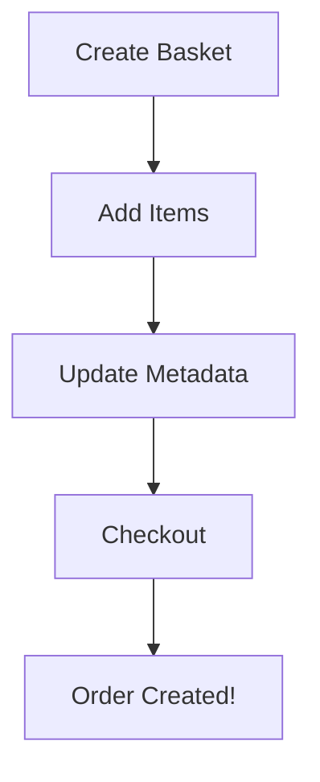

## Overview

**File**: `src/tools/BasketTool.ts`

Nine tools demonstrating the complete shopping cart workflow from creation to checkout.

## The Complete Shopping Flow



<Steps>
  <Step title="Create Basket">
    Start a new shopping session
  </Step>
  
  <Step title="Add Items">
    Add products to cart (can add multiple)
  </Step>
  
  <Step title="Manage Cart">
    Remove items, update quantities, add notes
  </Step>
  
  <Step title="Checkout">
    Convert basket to order
  </Step>
</Steps>

## Key Tools

### CreateBasketTool

```typescript
import { LuaTool, Baskets } from 'lua-cli';
import { z } from 'zod';

export class CreateBasketTool implements LuaTool {
  name = "create_basket";
  description = "Create a new shopping basket";
  
  inputSchema = z.object({
    currency: z.string().default('USD')
  });

  async execute(input: z.infer<typeof this.inputSchema>) {
    const basket = await Baskets.create({
      currency: input.currency,
      metadata: { createdBy: 'chat' }
    });
    
    return {
      basketId: basket.id,
      message: "New basket created! Start adding items."
    };
  }
}
```

### AddItemToBasketTool

```typescript
export class AddItemToBasketTool implements LuaTool {
  name = "add_to_basket";
  description = "Add a product to the shopping basket";
  
  inputSchema = z.object({
    basketId: z.string(),
    productId: z.string(),
    quantity: z.number().min(1).default(1)
  });

  async execute(input: z.infer<typeof this.inputSchema>) {
    // Get product to get current price
    const product = await Products.getById(input.productId);
    
    // Check stock
    if (!product.inStock) {
      return {
        success: false,
        message: `${product.name} is currently out of stock`
      };
    }
    
    // Add to basket
    const updated = await Baskets.addItem(input.basketId, {
      id: input.productId,
      price: product.price,
      quantity: input.quantity,
      SKU: product.sku
    });
    
    return {
      basketId: updated.id,
      itemCount: updated.common.itemCount,
      total: `$${updated.common.totalAmount.toFixed(2)}`,
      message: `Added ${input.quantity}x ${product.name} to basket`
    };
  }
}
```

### CheckoutBasketTool

```typescript
export class CheckoutBasketTool implements LuaTool {
  name = "checkout_basket";
  description = "Complete purchase and create order";
  
  inputSchema = z.object({
    basketId: z.string(),
    shippingAddress: z.object({
      street: z.string(),
      city: z.string(),
      zip: z.string()
    }),
    paymentMethod: z.string().default('stripe')
  });

  async execute(input: z.infer<typeof this.inputSchema>) {
    const order = await Baskets.placeOrder({
      shippingAddress: input.shippingAddress,
      paymentMethod: input.paymentMethod
    }, input.basketId);
    
    return {
      orderId: order.id,
      status: order.common.status,
      total: `$${order.common.totalAmount.toFixed(2)}`,
      message: "Order created successfully!"
    };
  }
}
```

## All 9 Tools

1. **CreateBasketTool** - Start shopping
2. **GetBasketsTool** - List all baskets
3. **AddItemToBasketTool** - Add products
4. **RemoveItemFromBasketTool** - Remove products
5. **ClearBasketTool** - Empty cart
6. **UpdateBasketStatusTool** - Change status
7. **UpdateBasketMetadataTool** - Add notes/data
8. **CheckoutBasketTool** - Convert to order
9. **GetBasketByIdTool** - View specific basket

## Testing the Flow

```bash
lua dev
```

Try this conversation:
1. "Create a shopping basket"
2. "Search for laptop"
3. "Add that laptop to my basket"
4. "Show me my cart"
5. "Checkout with shipping to 123 Main St, New York"

## What You'll Learn

<CardGroup cols={2}>
  <Card title="Multi-Step Workflows" icon="diagram-project">
    Handle complex processes
  </Card>
  <Card title="State Management" icon="database">
    Track cart state over time
  </Card>
  <Card title="API Chaining" icon="link">
    Combine multiple API calls
  </Card>
  <Card title="Business Logic" icon="brain">
    Implement e-commerce rules
  </Card>
</CardGroup>

## Next Steps

<CardGroup cols={2}>
  <Card
    title="Baskets API"
    icon="book"
    href="/api/baskets"
  >
    Complete API reference
  </Card>
  <Card
    title="Orders API"
    icon="receipt"
    href="/api/orders"
  >
    Manage orders after checkout
  </Card>
</CardGroup>

